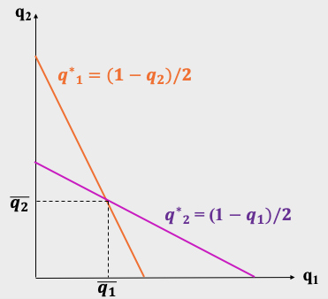
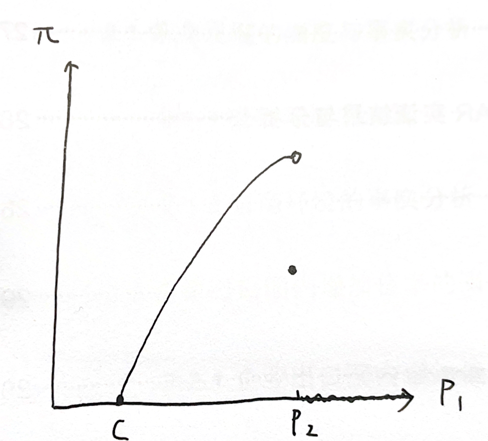

<!-- #REGION -->
    
<!-- #ENDREGION -->

# **纯策略纳什均衡: 无穷博弈情形**

# **(古诺模型 + 伯特兰模型)**

## 授课教师: **雷浩然**

## 湖南大学课程

---

# 导言
- 对于两人博弈且**行动集有限**的情形, 可以用"下划线法"来寻找纳什均衡.
- 在这一讲里, 我们用两个例子, 来说明**行动集无穷**时寻找纳什均衡的方法.
  - 例1: 古诺模型 
  - 例2: 伯特兰模型

- 这两个模型是*产业组织* (*Industrial Organization*) 中最常用的基本模型
  - 产业组织: "研究市场在不完全竞争条件下的企业行为和市场结构，是微观经济学中的一个重要分支."
  - 博弈论是产业组织研究中最重要的理论工具. 你可以通过这一讲的学习来 "略微感受" 产业组织理论的研究套路.

---

# 最优反应函数
- 对于两人有限博弈, 我们可以
  1. 先用*下划线*标出每个参与人所有可能的最优反应
  1. 再用纳什均衡的定义来找出对应的策略组合 

---

# 最优反应函数
- 对于两人有限博弈, 我们可以
  1. 先用*下划线*标出每个参与人所有可能的最优反应
  1. 再用纳什均衡的定义来找出对应的策略组合 

- 如果行为人的可能行动有无穷多个, 我们可以
  1. 先用*最优反应函数*来描述每个参与人所有可能的最优反应
  1. 再用纳什均衡的定义来找出对应的策略组合

注: 对于无穷多可能行动的情形, 我们一般要用**微分**来求解所有可能的最优反应

---

# 用微分求解最优反应函数
- 考虑两人博弈, 张三 (行为人 $1$) 的效用函数为 $u_1(a_1, a_2)$.
  - 其中 $a_1$ 是张三的行动, $a_2$ 是李四的行动 

- 对于某个给定的 $a_2$, 张三的最优反应等价于求解如下优化问题:
    $$ 
    \max_{a_1} u_1 (a_1, a_2)
    $$

---

# 用微分求解最优反应函数
- 考虑两人博弈, 张三 (行为人 $1$) 的效用函数为 $u(a_1, a_2)$.
  - 其中 $a_1$ 是张三的行动, $a_2$ 是李四的行动 

- 对于某个给定的 $a_2$, 张三的最优反应等价于求解如下优化问题:
    $$ 
    \max_{a_1} u_1 (a_1, a_2)
    $$

- 对于有限博弈, 这个优化问题的解可以"一眼看出" (下划线法)    
  对于无穷博弈, 我们可以用微分来计算**最优反应函数** $a_1^*( a_2)$, 它由如下一阶条件决定:
    $$
    \frac{\partial u_1 (a_1, a_2)}{\partial a_1} = 0
    $$ 

---

<!-- _class: lead -->

# 古诺模型
## **(寡头厂商同时定产博弈)**

---

# Antoine Augustin Cournot

- 法国哲学家, 数学家, 经济学家**古诺** (**Cournot**, 1801 $-$ 1877) 
- 古诺在
  <i> Researches on Mathematical Principles of the Theory of Wealth </i> 一书中*用数学模型分析了寡头市场*
- 这本书出版于 1838 年, 远远早于纳什均衡的提出 (Nash, 1950).   
- 但是, 用今天的眼光来看, 古诺提出的寡头市场模型中, 用到的主要工具恰恰就是纳什均衡.

---

# 古诺模型

- **参与人**: 张三钢铁厂和李四钢铁厂
- **行动**: 张三选择产量 $q_1 \in [0, \infty)$,
         李四选择产量 $q_2 \in [0, \infty)$  

- **效用**: 张三和李四的效用为其最终利润.
  - 假设边际成本为零.
  - 钢铁的价格由需求曲线 $P(Q)$ 决定, 其中 $Q = q_1 + q_2$ 为钢铁总产量.
    - 令 $P(Q) = 1 - Q$.
    - 由于价格不可能为负, 若 $Q>1$, 令 $P(Q) = 0$. 

---

# 最优反应函数

- 张三的利润函数 (or, 效用函数):
  $$
  u_1(q_1, q_2) = P(Q) \cdot q_1 = (1 - q_1 - q_2) q_1
  $$  

---

# 最优反应函数

- 张三的利润函数 (or, 效用函数):
  $$
  u_1(q_1, q_2) = P(Q) \cdot q_1 = (1 - q_1 - q_2) q_1
  $$  

- **求解张三的最优反应函数**: 给定 $q_2$, 张三的最优反应 $q_1^*$最大化张三的效用 
  $$
  \frac{\partial u_1(q_1, q_2)}{\partial q_1} \mid _{q_1 = q_1^*} = 0
  $$

---

# 最优反应函数

- 张三的利润函数 (or, 效用函数):
  $$
  u_1(q_1, q_2) = P(Q) \cdot q_1 = (1 - q_1 - q_2) q_1
  $$  

- **求解张三的最优反应函数**: 给定 $q_2$, 张三的最优反应 $q_1^*$最大化张三的效用 
  $$
  \frac{\partial u_1(q_1, q_2)}{\partial q_1} \mid _{q_1 = q_1^*} = 0
  $$

  $$
  \implies 1- q_1^* -q_2 - q_1^* = 0   
  $$

---

# 最优反应函数

- 张三的利润函数 (or, 效用函数):
  $$
  u_1(q_1, q_2) = P(Q) \cdot q_1 = (1 - q_1 - q_2) q_1
  $$  

- **求解张三的最优反应函数**: 给定 $q_2$, 张三的最优反应 $q_1^*$最大化张三的效用 
  $$
  \frac{\partial u_1(q_1, q_2)}{\partial q_1} \mid _{q_1 = q_1^*} = 0
  $$

  $$
  \implies 1- q_1^* -q_2 - q_1^* = 0   
  $$

- 张三的最优反应函数: $q^*_1 (q_2) = (1 - q_2) /2$
  - 这个函数描述了给定李四的产量 $q_2$, 张三的最优反应 $q_1^*$

---

# 纳什均衡
- 根据对称性, 李四的最优反应函数为 
$$
q^*_2 (q_1) = (1 - q_1) /2
$$

1. 先用*最优反应函数*来描述每个参与人所有可能的最优反应 **(已完成)**
1. 再用纳什均衡的定义来找出对应的策略组合 

---

# 纳什均衡
- 根据对称性, 李四的最优反应函数为 
$$
q^*_2 (q_1) = (1 - q_1) /2
$$

1. 先用*最优反应函数*来描述每个参与人所有可能的最优反应 **(已完成)**
1. 再用纳什均衡的定义来找出对应的策略组合
   - 纳什均衡是一组特殊的策略组合 $(\bar q_1, \bar q_2)$, 使得 
     1. $\bar q_1$ 是针对 $\bar q_2$的最优反应
     2. $\bar q_2$ 是针对 $\bar q_1$的最优反应

---

# 纳什均衡
- 根据对称性, 李四的最优反应函数为 
$$
q^*_2 (q_1) = (1 - q_1) /2
$$

1. 先用*最优反应函数*来描述每个参与人所有可能的最优反应 **(已完成)**
1. 再用纳什均衡的定义来找出对应的策略组合
   - 纳什均衡是一组特殊的策略组合 $(\bar q_1, \bar q_2)$, 使得 
     1. $\bar q_1$ 是针对 $\bar q_2$的最优反应: *$q_1^*(\bar q_2) = \bar q_1$*
     2. $\bar q_2$ 是针对 $\bar q_1$的最优反应: *$q_2^*(\bar q_1) = \bar q_2$*
   - 联立方程:
     $$
     (1 - \bar q_1) /2 = \bar q_2, \quad
     (1 - \bar q_2) /2 = \bar q_1  \implies \bar q_1 = \bar q_2 = 1/3
     $$  

---

## 

## 纳什均衡: 图示

---

**练习 1:** 假设张三钢铁厂的初始计划产量为 $q_{10} \in (0,\frac 12)$.
- 给定张三的计划产量 $q_{10}$, 李四的最优反应为 
$$
q_{20} = q^*_2 (q_{10})
$$
- 给定李四的计划产量 $q_{20}$, 张三将产量调整到对应的最优反应: 
$$
q_{11} = q^*_1 (q_{20})
$$
- 给定张三新的计划产量 $q_{11}$, 李四的最优反应变为
$$
q_{21} = q^*_2 (q_{20})
$$
- 重复以上过程, 得到两组序列 $\{q_{10}, q_{11}, q_{12}, ...\}$, 
  $\{q_{20}, q_{21}, q_{22}, ...\}$

---

**证明:** 这两个序列
$$
\{q_{10}, q_{11}, q_{12}, ...\}
$$
$$
\{q_{20}, q_{21}, q_{22}, ...\}
$$
会分别收敛到对应的纳什均衡产量: ($\bar q_1$, $\bar q_2$).

- 提示: 结合最优反应的函数图像, **画图说明**即可

---

**练习 2:** 此前在求解古诺模型的均衡产量 $(\bar q_1, \bar q_2)$ 时,
我们假设成本函数为零.   
- 假设张三和李四的成本函数分别为 $C_1(q_1) = c_1 q_1$, $C_2(q_2) = c_2 q_2$, 其中 $c_1 > 0$ 和 $c_2 > 0$ 分别是张三和李四的单位成本.
- **问1:** 若 $1/2 > c_2 > c_1$, 你觉得均衡时哪家厂商的产量更高?
- **问2:** 求解这种情况下的纳什均衡, 并验证你上一问的猜想是否正确.

---

**练习 3:** 我们仍然假设成本函数为零, 但假设市场上有 $n \ge 2$家企业.

1. 计算此时每家厂商的均衡产量 $\bar q$, 把它表示为 $n$ 的函数.
1. 计算均衡时每家厂商的利润 $\bar \pi$, 把它表示为 $n$ 的函数.
1. 证明: $\bar \pi$ 关于 $n$ 递减; 并且,
   随着 $n$ 趋于无穷, $\bar \pi$ 趋于零.

**注.** 第三小问的结论说明:

- 随着市场竞争加剧, 寡头厂商的利润会逐步下降.
- 当厂商的数量无穷多时 (即完全竞争市场情形), 厂商的定价等于其边际成本 (0), 均衡利润为零.

---

<!-- _class: lead -->

# 伯特兰模型
## **(寡头厂商同时定价博弈)**

---

# Joseph Louis François Bertrand

- 法国数学家, 物理学家, 经济学家伯特兰 (1822 $-$ 1900)
- 伯特兰的父亲是医生和生物学家. 受到父亲的影响,
  伯特兰九岁时就开始学习高等数学, 并且熟练掌握当时学界的通用语言(拉丁语). 
- 伯特兰 11 岁时在巴黎综合理工旁听大学课程, 17 岁拿到了两个本科学位, 一个数学物理博士学位, 以及一个工程师资格证书.
- 作为学者, 伯特兰的主要贡献在微分几何, 数论, 热力学等领域. 
- 今天伯特兰仍为学界所熟知, 主要是因为以他命名的两个悖论 (**伯特兰悖论**):
  - 一个悖论涉及初等概率论 ([李永乐视频链接](https://www.ixigua.com/7158761116787704354)) 
  - 另一个悖论就是我们即将介绍的博弈论模型.

---

# 伯特兰模型 (寡头同时定价模型)
古诺 v.s. 伯特兰
- 古诺模型中, 厂商同时选择某个产量 $q$
- 伯特兰模型中, 厂商同时选择某个价格 $p$

---

# 伯特兰模型 (寡头同时定价模型)

伯特兰模型中, 张三钢铁厂和李四钢铁厂的**效用函数**通过如下方式计算:
- 需求函数 $Q(p)$ 连续并且严格递减, 其中市场价格 $p$ 为 $p_1$ 和 $p_2$ 中的较小值: 
  - $p = \min \{p_1, p_2\}$
- 若张三定价 $p_1$ 低于李四定价 $p_2$, 则张三垄断整个市场并获得垄断利润,
  李四的利润为零.  
- 若张三和李四定价相同, 则两人平分垄断利润. 

张三和李四的边际成本均为 $c>0$. 如何计算纳什均衡 $(\bar p_1, \bar p_2)$?

---

# 伯特兰模型: 最优反应函数

给定李四的定价 $p_2 > c$, 张三的利润 $\pi(p_1)$ 为:
$$
\pi(p_1) = \begin{cases}
(p_1 - c) Q(p_1) & \text { 若 }  p_1 \in [c, p_2) \\ 
(p_1 - c) Q(p_1) /2 & \text { 若 }  p_1 = p_2\\
0 & \text { 若 }  p_1 > p_2
\end{cases}
$$

- 张三会比李四的定价 $p_2$ 低一点, 但又只低一点点...
- 这时, 张三的最优反应函数不存在. 因为函数 $\pi(p_1)$ 无最大值点.   

---

# 伯特兰模型: 最优反应函数

给定李四的定价 $p_2 > c$, 张三的利润 $\pi(p_1)$ 为:
$$
\pi(p_1) = \begin{cases}
(p_1 - c) Q(p_1) & \text { 若 }  p_1 \in [c, p_2) \\ 
(p_1 - c) Q(p_1) /2 & \text { 若 }  p_1 = p_2\\
0 & \text { 若 }  p_1 > p_2
\end{cases}
$$

- 张三会比李四的定价 $p_2$ 低一点, 但又只低一点点...
- 这时, 张三的最优反应函数不存在. 因为函数 $\pi(p_1)$ 无最大值点.   

**结论.** 纳什均衡中, 李四的定价不可能大于 $c$. 由对称性,
张三的定价也不大于 $c$.
         
---

---
# 伯特兰模型: 纳什均衡
 
另一方面, 厂商不可能亏本经营, 因此定价不会低于 $c$.  

$\implies$  $(c,c)$ 是唯一可能的纯策略纳什均衡.

---

# 伯特兰模型: 纳什均衡
 
另一方面, 厂商不可能亏本经营, 因此定价不会低于 $c$.  

$\implies$  $(c,c)$ 是唯一可能的纯策略纳什均衡.

- 给定张三定价 $c$, $p_2 = c$ 是李四的最优反应? ✅
- 给定李四定价 $c$, $p_1 = c$ 是张三的最优反应? ✅

$\implies$  **$(c,c)$ 是纳什均衡.**

---

# 伯特兰模型: 另一种求解思路

- 不同于古诺模型, 我们无法 (i) 先用一阶条件写出最优反应 (ii) 再联立最优反应函数来求解纳什均衡.

- 这是因为, 伯特兰模型中张三的利润(效用)函数存在一个不连续点 $p_2$. 它导致对于任何李四的定价 $p_2 > c$, 张三的最优反应不存在.
 
- 对于伯特兰模型, 
我们也可以绕过求解最优反应函数, 直接用"行为人是否有偏离均衡的激励" 的方式来证明 $(c,c)$ 是唯一的纯策略纳什均衡.

---

**定理**: 伯特兰模型存在唯一的纯策略纳什均衡: $(\bar p_1, \bar p_2) = (c,c)$. 

**证明思路:**
1. 证明 $(c,c)$ 为纳什均衡.
1. 证明不存在其他纯策略纳什均衡.

---

**定理**: 伯特兰模型存在唯一的纯策略纳什均衡: $(\bar p_1, \bar p_2) = (c,c)$. 

**证明思路:**
1. 证明 $(c,c)$ 为纳什均衡. *(按照纳什均衡的定义验证即可)*
1. 证明不存在其他纯策略纳什均衡.  *(反证法)*

---

假设 $(\bar p_1, \bar p_2)$ 为纳什均衡.

- 均衡中, 厂商不会亏本经营. 否则, 亏本经营的厂商可以提价到 $p = c$, 从负利润变为零利润.
  - 结论1: $\min \{\bar p_1 ,\bar p_2\} \ge c$.

- 均衡中, 两家厂商的定价一定相同. 否则, 不妨令 $\bar p_1  > \bar p_2 \ge c$. 此时厂商 2 可以将价格从 $\bar p_2$ 提高到 $(\bar p_1  + \bar p_2)/2$, 并获得更高的利润.
  - 结论2: $\bar p_1 = \bar p_2 = \bar p \ge c$.

- 均衡中, 一定有 $\bar p = c$. 否则, 给定厂商 1 的定价 $\bar p > c$, 存在某个充分小的正数 $\varepsilon > 0$, 使得厂商 2 可以降价到
  $\bar p - \varepsilon$, 并获得更高的利润.
  - 结论3: $\bar p_1 = \bar p_2 = c$ 是唯一可能的纯策略纳什均衡.
  
---

<!-- **注:** 细心的同学可能发现, 我们上面给出的结论是"存在唯一的**纯策略**纳什均衡".

- 类似"约会博弈"和"石头剪刀布博弈", 伯特兰模型还存在其他的**混合策略**纳什均衡.
  我们之后会介绍.
- **混合策略**要求厂商随机定价, 现实中, 厂商的定价一般都不是随机的.
- 因此, 这里的"混合策略均衡"只是理论上存在, 通常没有经济学意义.
- 这门课中, 我们只关注伯特兰模型中的纯策略均衡: $(c, c)$.

---
-->
# 伯特兰悖论

- 相比古诺模型, 伯特兰模型只做了一个"小改动": 从同时*定产*变为同时*定价*
- 但是, 不同于古诺模型, **伯特兰模型的预测和通常的经济学直觉相差非常大**.
- 古诺模型中, 寡头厂商的均衡利润始终为正, 并且均衡利润和厂商数量 $n$ 负相关.
    - 这和经济学原理中的直觉相符 (✅) 
- 伯特兰模型中, 即使只有两家厂商, 厂商的均衡利润也为零.
    - 严重违反了经济学原理中的直觉(以及人们的日常经验) (❌)
    - 因此, 伯特兰模型的结果常常被称为"伯特兰悖论".

---
hugo
# 伯特兰悖论: 原因何在

是因为"同时定价"这个假设不符合实际么?
- 不是这个原因. 
- 相比"同时定产", "同时定价"假设其实更符合现实.
  - 现实中绝大多数企业都是先制定价格, 然后根据潜在的市场需求,
    来判断是进一步降价或提价. 

---

# 伯特兰悖论: 原因何在

在产业组织的相关研究中,
伯特兰模型是最常用的基本模型之一 (即所谓的 workhorse model).
研究者们通常会加入如下额外假设:

- 厂商的产能有上限. 这时, 即使 $p_1 < p_2$, 厂商 1 也无法获取垄断利润, 因为产能不足 (Bertrand-Edgeworth 模型)
- 厂商的价格不是公开透明的. 消费者必须付出一定的搜寻成本, 才能得知真实的价格. (Varian, 1980: A Model of Sales)
- 两家厂商的产品存在差异性, 不能完全替代 (教材的例子, P45)
- ...

这些额外假设避免了伯特兰悖论的出现.

---

# 练习一
- 存在产品差异的伯特兰模型 (教材 P45)
- 公共资源问题 (教材 P46)

这两个博弈的纳什均衡求解方式和课上介绍的古诺模型完全相同:
1. 先用微分求解**最优反应函数**
1. 联立方程, 计算纳什均衡

请同学们自行看书, 教师不会在课堂上专门讲解这两个例子.

---

# 练习二
对于伯特兰模型, 证明下面两个命题成立.

1. 定价 $p_1 = c$ 是张三的劣势策略. 
1. 定价 $p_1 = c$ 是张三的不严格劣势策略.

- 注:
  - 我们之前介绍过, 博弈的参与人在纳什均衡中不可能使用严格劣势策略,
    但有可能使用劣势策略.
  - 伯特兰博弈提供了一个很好的例子: 这个博弈存在唯一的纯策略纳什均衡, 其中每个参与人的策略都是劣势策略.