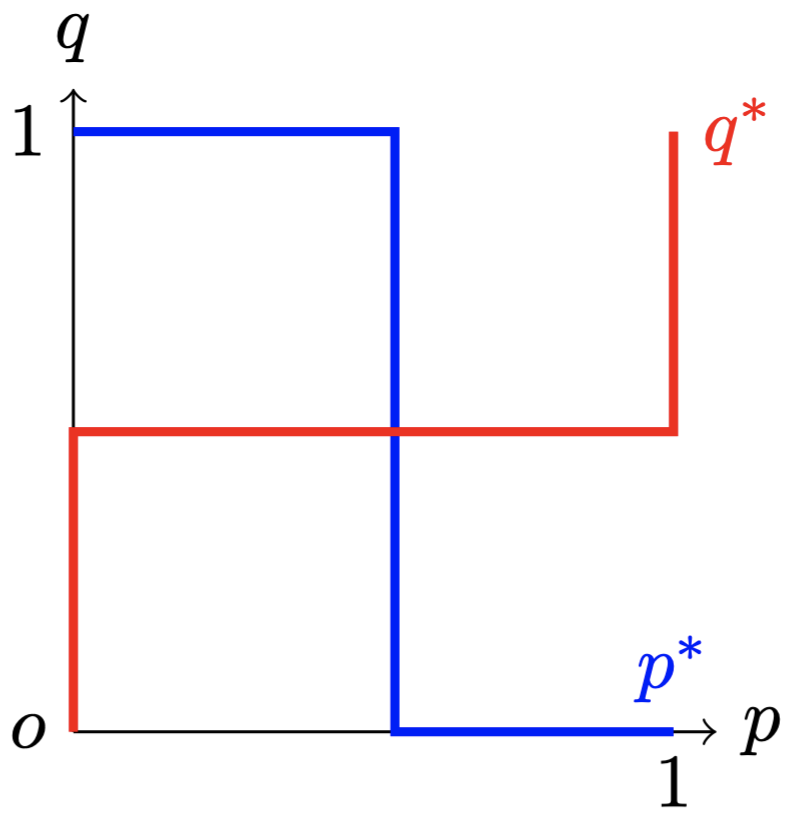

$$
\newcommand{\bp}{\mathbf{p}}
$$

<!-- #REGION -->
    
<!-- #ENDREGION -->

# **混合策略**

## 授课教师: **雷浩然**

## 湖南大学课程

---

# 混合策略
- 考虑两人博弈: $N=$ {张三, 李四}.
张三的行动集为 $A_1 = \{a_{11}, \dots, a_{1m} \}$.

- 在此前的分析中, 我们假设张三会以概率 $1$ 选择某个特定的行动 $a \in A_1$.

- 实际博弈中, 张三可以按照某个 **概率分布** $\bp_1 = (p_{11}, ..., p_{1m})$ 来随机化他的最终选择, 其中 $p_{1k}$ 表示张三最终选择为 $a_{1k}$ 的概率.
$$
\begin{gather*}
p_{11} + p_{12} + \dots + p_{1m} = 1 \\
0 \le p_{1k} \le 1, \forall k \in \{1,...,m\}
\end{gather*}
$$

---

# 混合策略: 猜硬币博弈

张三\李四 | 正面 | 反面
---------|----------|---------
 正面 | $(-1,1)$ | $(1,-1)$
 反面 | $(1,-1)$ | $(-1,1)$

张三选择硬币的正面和反面,
李四猜张三的决定.

张三的策略可以表示为 $(p, 1-p)$:
- $p \in (0,1)$ 为张三选择"正面"的概率,
    $1-p$ 为张三选择"反面"的概率.
- 当 $p=0$ 或 $p=1$ 时, 张三的混合策略退化为**纯策略**.

---

# 概率分布: 离散型和非离散型
- 如果张三的**行动集是有限**的, 他的混合行动对应的概率分布是**离散型**的. 
    - 对于离散型的概率分布, 我们一般用向量表示如下:
    $$
    p_1 = (p_{11}, ..., p_{1m})
    $$

- 如果张三的**行动集是无限**的,
他的混合行动对应的概率分布可能非常复杂:
    - 可能是连续型 (比如, 在某个区间上连续分布);
    - 可能是半离散-半连续型.
    - 这门课程里, 当参与人的行动集是无限时, 我们只讨论纯策略纳什均衡 (例: 古诺博弈均衡, 伯特兰博弈均衡).

---
# 期望效用

- 若行为人的策略是随机的, 博弈的可能结果也是随机的.
- 这时, 行为人的目标是最大化他的**期望效用**.
- 计算期望效用:
  *将每个可能博弈结果中的效用依概率加权求和*.

---

# 计算期望效用: 猜硬币博弈 
令张三和李四的混合策略分别为 $(p, 1-p)$ 和 $(q, 1-q)$.

最终博弈结果的概率分布如下表所示:

张三\李四 | 正面 ∘ $q$  | 反面 ∘ $(1-q)$
---------|----------|---------
 正面 ∘ $p$ |$(-1,1)$ ∘ $pq$ | $(1,-1)$ ∘ $p (1-q)$
 反面 ∘ $(1-p)$ | $(1,-1)$ ∘ $(1-p)q$ |$(-1,1)$ ∘ $(1-p)(1-q)$

---

# 猜硬币博弈: 计算期望效用
令张三和李四的混合策略分别为 $(p, 1-p)$ 和 $(q, 1-q)$.

最终博弈结果的概率分布如下表所示:

张三\李四 | 正面 ∘ $q$  | 反面 ∘ $(1-q)$
---------|----------|---------
 正面 ∘ $p$ |$(-1,1)$ ∘ $pq$ | $(1,-1)$ ∘ $p (1-q)$
 反面 ∘ $(1-p)$ | $(1,-1)$ ∘ $(1-p)q$ |$(-1,1)$ ∘ $(1-p)(1-q)$

张三的期望效用:
$$
pq ⋅ (-1) + p (1-q) ⋅ 1 + (1-p)q ⋅ 1 + (1-p)(1-q) ⋅ (-1)
$$

---

# 混合策略纳什均衡
考虑两人博弈, **混合策略纳什均衡**是一个特殊的策略组合 $(\bp_1, \bp_2)$,
使得 $\bp_1$ 和 $\bp_2$ 互为最优反应.

- 向量 $\bp_1$ 和 $\bp_2$ 分别表示行为人 1 和行为人 2 的混合策略:
  $$
  \bp_1 = (p_{11}, ..., p_{1m})
  $$
  $$
  \bp_2 = (p_{21}, ..., p_{2k})
  $$

- 当两个策略 $\bp_1$ 和 $\bp_2$ 都退化到**纯策略**情形时, 混合策略纳什均衡退化为**纯策略纳什均衡**. 

---

# 计算混合策略均衡: 猜硬币博弈

- 用下划线法可知, "猜硬币博弈"不存在纯策略纳什均衡
- 根据纳什定理, 这个有限博弈存在纳什均衡. $\implies$ 存在混合策略纳什均衡
- 混合策略的分析比纯策略更复杂:
  - 张三只有两个纯策略
  - 张三有无穷多个混合策略, 每个不同的 $p \in [0,1]$ 对应不同的混合策略.

计算混合策略均衡:
- 给定李四的策略 $(q, 1-q)$, 张三选择某个最优的混合概率 $p^*$, 得到最优反应函数 $p^*(q)$.
- 类似地, 计算出李四的最优反应函数 $q^*(p)$. 联立方程求解均衡.

---

# 张三的最优反应
张三的期望效用:
- $U_1(p,q) = -pq + p (1-q) + (1-p)q - (1-p)(1-q)$
$$
\frac{\partial U_1(p,q)}{\partial p} = 2(1-2q)
$$

---

# 张三的最优反应
张三的期望效用:
- $U_1(p,q) = -pq + p (1-q) + (1-p)q - (1-p)(1-q)$
$$
\frac{\partial U_1(p,q)}{\partial p} = 2(1-2q)
$$

张三的最优反应:
$$
p^* (q) = \begin{cases} 
1  &\text{若 } q < 1/2  \\
p^* \in [0,1] &\text{若 }q = 1/2 \\
0  &\text{若 } q > 1/2
\end{cases}
$$

---
# 理解张三的最优反应
$$
p^* (q) = \begin{cases} 
1  &\text{若 } q < 1/2  \\
p^* \in [0,1] &\text{若 }q = 1/2 \\
0  &\text{若 } q > 1/2
\end{cases}
$$

- 若李四"猜正"的概率**小于** $1/2$, 张三的最优反应是使硬币**正面**朝上
- 若李四"猜正"的概率**大于** $1/2$, 张三的最优反应是使硬币**反面**朝上
- 若李四"猜正"的概率*等于* $1/2$, 张三对于"正"和"反"*无差异*. 
  - 此时, 任何混合策略都是张三的最优反应. $\frac{\partial U_1(p, 1/2)}{\partial p} =0$

---
# 混合策略纳什均衡

- 用同样的方法, 可以求出李四的最优反应 $q^*(p)$.

- 纳什均衡由参数 $\bar p$ 和 $\bar q$ 决定:
  - $q^*(\bar p) = \bar q$
  - $p^*(\bar q) = \bar p$

- 注意: 描述纳什均衡时, 不要只答 $\bar p$ 和 $\bar q$, 而是要说明张三和李四的混合策略.
  - 张三的混合策略: $(\bar p, 1-  \bar p)$
  - 李四的混合策略: $(\bar q, 1-  \bar q)$

---

## 

## **纳什均衡:** 张三策略 (1/2, 1/2), 李四策略 (1/2, 1/2)

---

# 无差异原则

- 计算混合策略均衡的常用技巧: **无差异原则**

- 无差异原则的思想很简单: 
  - 如果均衡中张三会在 $a_1$ 和 $a_1'$ 之间随机,
  那么 $a_1$ 和 $a_1'$ 这两个纯策略本身就是张三的最优反应.
  - 这时, 这两个纯策略带给张三的效用肯定是相同的. 也就是说, 张三对 $a_1$ 和 $a_1'$ 无差异.

---

# 无差异原则
**定理 (无差异原则).** 如果在混合策略均衡中, 张三选择行动 $a_1$ 和 $a_1'$ 的概率均为正. 那么给定均衡中其他参与人的策略,  张三对 $a_1$ 和 $a_1'$ 这两个纯策略是无差异的.

证明思路如下:
- 均衡中, 张三选择
$a_1$ 和 $a_1'$ 的概率分别记为 $p$ 和 $p'$.   
有: $p >0$, $p' >0$, $p + p' \le 1$.
- 为简化讨论, 假设 $p + p' = 1$. 即张三只在 $a_1$ 和 $a_1'$ 之间随机.
- 张三偏离到纯策略 $a_1$ 后的效用记为 $u$
- 张三偏离到纯策略 $a_1'$ 后的效用记为 $u'$
- 张三在均衡中的期望效用: $pu + p' u' = pu + (1-p)u'$

---

- 根据纳什均衡的定义:
$$
pu + (1-p)u' \ge u
$$
$$
pu + (1-p)u' \ge u'
$$
$$
\implies u = u'
$$
即张三对于$a_1$ 和 $a_1'$ 无差异. 证毕.

---

# 无差异原则的应用: 猜硬币博弈
- 记纳什均衡为: $(\bar p,1- \bar p)$ 和 $(\bar q,1- \bar q)$
- 张三对于"正面"和"背面" 无差异:
  $$
  \bar q - (1- \bar q) = -\bar q + (1 -\bar q)  \implies  \bar q = 1/2
  $$

- 李四对于"正面"和"背面" 无差异:
  $$
  \bar p - (1- \bar p) = -\bar p + (1 -\bar p)  \implies  \bar p = 1/2
  $$

---

# 约会博弈

张三\李四 | 网吧 | 商场
---------|----------|---------
 网吧 | (2, 1) | (0, 0)
 商场 | (0, 0) | (1, 2)

计算混合策略均衡: $(p, 1-p)$ 和 $(q, 1-q)$.   
其中 $p$ 和 $q$ 分别表示均衡中张三和李四去网吧的概率.

---

张三\李四 | 网吧 | 商场
---------|----------|---------
 网吧 | (2, 1) | (0, 0)
 商场 | (0, 0) | (1, 2)

- 给定李四的策略 $(q, 1-q)$, 张三对网吧和商场无差异:
  - $2 ⋅ q + 0⋅(1-q) = 0⋅q + 1⋅(1-q)$ $\implies$ $q =1/3$

- 给定张三的策略 $(p, 1-p)$, 李四对网吧和商场无差异:
  - $1 ⋅ p + 0⋅(1- p) = 0⋅p + 2⋅(1-p)$ $\implies$ $p = 2/3$

- 纳什均衡:
  - 张三去网吧概率为 2/3, 去商场概率为 1/3
  - 李四去网吧概率为 1/3, 去商场概率为 2/3

---

- 混合策略纳什均衡下的结果分布

张三\李四 | 网吧 ∘ 1/3 | 商场 ∘ 2/3
---------|----------|---------
 网吧 ∘ 2/3 | (2, 1) ∘ 2/9 | (0, 0) ∘ 4/9
 商场 ∘ 1/3| (0, 0) ∘ 1/9 | (1, 2) ∘ 2/9

- 混合策略均衡中, 张三和李四的期望收益均为 2/3.
  - 这个均衡结果非常低效, 两个参与人的福利都严格小于纯策略中的情形.
  - 均衡低效的原因: 均衡结果中, 参与人没有碰面的概率高达 5/9

---

# 从纳什均衡到相关均衡
- 真实的情侣约会中, 张三和李四一般会进行事前协商, 约定好双方选择"网吧"还是"商场"
- 具体的, 参与人可以通过使用某个"随机数生成器"来选择纳什均衡. 
- 比如, 两人玩"猜硬币博弈".
  张三胜就去网吧, 李四胜就去商场.
- 由于两人获胜的概率均为 1/2. 最后张三和李四的期望效用均为 $(3/2,3/2)$, 这个结果严格好于混合策略纳什均衡的期望效用 $(2/3, 2/3)$. 

- 我们称这样的均衡为**相关均衡**

---

# 相关均衡: 定义 (不严格)

- 当博弈中存在多个纳什均衡时, 博弈中的行为人可以**事先协商**, 约定届时会选择哪个纳什均衡. 
- 如果允许参与人可以根据某个事前观测到的**信号**选择行动, 这时的均衡概念被称为**相关均衡**
  - 纳什均衡可视作相关均衡的特例. 在纳什均衡中, 参与人没有事先可观测到的信号.

---

# 相关均衡例子

- 除了情侣通过猜数字决定去网吧还是商场外, 相关均衡的另一个常见例子是**红绿灯**.

- 张三和李四驾车于十字路口交汇. 两人可以选择
  1. 停车, 让对方先走
  1. 不停. 

张三\李四 | 停车 | 不停
---------|----------|---------
 停车 | $(-1, -1)$ | $(0, 1)$
 不停 | $(1, 0)$ | $(-10, -10)$

---

# 相关均衡例子: 红绿灯

- 类似约会博弈, 上面这个博弈有两个纯策略均衡: (停车, 不停), (不停, 停车) 以及一个混合策略均衡.

- 现实中, 路口往往会安装红绿灯. 张三和李四会根据红绿灯这个"公共信号" 在
(停车, 不停) 和 (不停, 停车) 这两个纳什均衡之间进行选择.