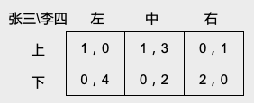
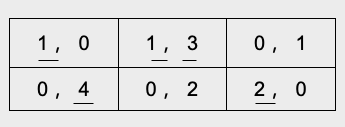

<!-- #REGION -->
    
<!-- #ENDREGION -->

# **纳什均衡: 最优反应, 下划线法**
## 授课教师: **雷浩然**
## 湖南大学课程

---

# 纳什均衡: Nash (1950) 和 Nash (1951)

John Nash (1950): "Equilibrium points in $n$-person games"

- 在这篇论文中, Nash 提出均衡的概念, 并用 **Kakutani 不动点定理**证明了均衡的存在性.
- 课程网站提供了论文的 PDF. *全文仅一页*
- 后人将这种均衡称为**纳什均衡**, 均衡的存在性定理称为**纳什定理**.

在随后的一篇更正式的论文中, Nash 给出了一个均衡存在性的简化证明 (主要工具是
**Brouwer 不动点定理**), 以及纳什均衡在扑克牌游戏中的应用.

- John Nash (1951): "Non-cooperative games". 全文十页

---

# 最优反应

考虑如下两人同时行动博弈:
- 参与人: $N = \{1, 2\}$
- 行动集: $A_1, A_2$
- 效用函数: $u_1(a_1, a_2)$, $u_2(a_1,a_2)$

---

# 最优反应

考虑如下同时行动博弈:
- 参与人: $N = \{1, 2\}$
- 行动集: $A_1, A_2$
- 效用函数: $u_1(a_1, a_2)$, $u_2(a_1,a_2)$

**定义:** 给定参与人2的行动 $a_2$,
若行动 $a_1^* \in A_1$ 最大化了此时参与人 $1$ 的效用,
则称 $a_1^*$ 是对 $a_{2}$ 的**最优反应**.

- 例: 给定李四的行动 $a_2 =$ 石头, 张三的最优反应: $a_1^* =$ 布

---

# 最优反应: 数学描述 

给定 $a_2 \in A_2$, 若 $\blue{a_1^*}$ 是如下优化问题的解:
$$
\max_{a_1 \in A_1} u_1 (a_1, a_2)
$$
则称 $\blue{a_1^*}$ 是对 $a_{2}$ 的**最优反应**.

- 这个定义和前一页用文字描述的定义是等价的, 只不过这里用到了*最优化 (optimization)* 的数学语言. 
- 随着课程的不断深入, 我们会反复使用最优化的工具. 
  你需要熟悉上面用到的数学符号.

---

对于有限博弈 (即可以用收益矩阵来描述的博弈), 我们一般用**下划线**来标出参与人的**最优反应**.

---

# 下划线表示最优反应

---

# 最优反应: 约会博弈

张三 \ 李四 | 网吧 | 商场
---------|----------|---------
 网吧 | $(2,1)$ | $(0,0)$
 商场 | $(0,0)$ | $(1,2)$

---

# 最优反应: 约会博弈

张三 \ 李四 | 网吧 | 商场
---------|----------|---------
 网吧 | $(2,1)$ | $(0,0)$
 商场 | $(0,0)$ | $(1,2)$

张三 \ 李四 | 网吧 | 商场
---------|----------|---------
 网吧 | $(\underline{\red{2}}, \underline{\red{1}})$ | $(0,0)$
 商场 | $(0,0)$ | $(\underline{\red{1}}, \underline{\red{2}})$

---

# 纳什均衡: 两人博弈情形

定义: 对于两人博弈, 若策略组合
$(a_1^*, a_2^*)$ 满足如下要求: 

- $a_1^*$ 是对 $a_2^*$ 的最优反应
- $a_2^*$ 是对 $a_1^*$ 的最优反应

则称$(a_1^*, a_2^*)$为 **纳什均衡.**
- 也就是说, 纳什均衡中每个参与人的策略都是针对其他参与人策略的最优反应.

---

# 纯策略与混合策略
- 严格来讲, 我们在上一页给出的, 是**纯策略**纳什均衡的定义.
- 和纯策略相对应的另一个概念是**混合策略**, 也叫**随机策略**.
  - 顾名思义, 在混合策略 (随机策略) 中, 参与人的行动是随机的.
  - 我们需要使用基本的概率论工具来讨论混合策略.
  - 你也可以把"混合策略"叫作"混合行动".
    - 在这一章里(完备信息静态博弈) , 策略和行动这两个概念没有区别.

- 我们会在第二章的最后介绍混合策略以及对应的混合策略均衡.
  - 这一讲里, 我们**只讨论纯策略均衡**.

---

# 理解纳什均衡

$(a_1^*, a_2^*)$ 是纳什均衡意味着:
- 张三和李四都没有**单方面**偏离 $(a_1^*, a_2^*)$ 的激励.
- 纳什均衡 $\ne$ 社会最优. 博弈中可能存在某个结果 
  $(a_1', a_2')$, 使得张三和李四的福利都高于均衡 $(a_1^*, a_2^*)$ 对应的福利, 并且
  $(a_1', a_2')$ 不是纳什均衡.
  - 例: 囚徒困境

---

# 理解纳什均衡

$(a_1^*, a_2^*)$ 是纳什均衡意味着:
- 张三和李四都没有**单方面**偏离 $(a_1^*, a_2^*)$ 的激励.
- 纳什均衡 $\ne$ 社会最优. 博弈中可能存在某个结果 
  $(a_1', a_2')$, 使得张三和李四的福利都高于均衡 $(a_1^*, a_2^*)$ 对应的福利, 并且
  $(a_1', a_2')$ 不是纳什均衡.
  - 例: 囚徒困境

"个人理性" v.s. "集体理性" 

- 纳什均衡只考虑了行为人单方面偏离均衡的动机 (个人理性 ✅)
- 纳什均衡的结果不一定是社会最优的 (集体理性 ❌) 

---

# "看不见的手" 与 囚徒困境

亚当斯密:
- 个人在经济生活中只考虑自己利益，受“看不见的手”驱使，可以达到国家富裕的目的

约翰纳什:
- 如果个人在经济生活中只考虑自己利益, 可能只会两败俱伤, 而非合作共赢.

**问: 导致这两种不同结果的原因是什么?**

---

# "看不见的手" 与 囚徒困境

- "看不见的手" (福利经济学第一定理) 的成立条件: *完全竞争市场*,
  *无外部性*

- 这两个前提条件在一般的博弈模型中都不满足:
  - 博弈的参与人一般是有限的 (如"两人博弈"), 完全竞争市场要求市场上同时存在很多的卖家和很多的买家
    - 反例: 卖方垄断, 买方垄断
    - 博弈论常用于研究**不完全**竞争市场
  - 博弈中, 参与人1的行动不仅仅影响参与人1 的效用, 还影响参与人2 的效用
    - 参与人 1 的行动对参与人 2 存在 *"外部性"*
    - 上面这句话不严谨, 因为*外部性*这个概念是针对市场机制定义的.
      同学们领会其意思即可. 

---

# 寻找纳什均衡: 下划线法
- 根据纳什均衡的定义, 找纳什均衡就是在找参与人可能的最优反应.  
- 如果某个博弈结果中, 所有参与人的收益都有下划线, 那么导致这个结果的策略组合就是一个纳什均衡. 

---

# 寻找纳什均衡: 下划线法
- 根据纳什均衡的定义, 找纳什均衡就是在找参与人可能的最优反应.  
- 如果某个博弈结果中, 所有参与人的收益都有下划线, 那么导致这个结果的策略组合就是一个纳什均衡. 

张三 \ 李四 | 坦白 | 抵赖
---------|----------|---------
 坦白 | $(-1,-1)$ | $(1,-3)$
 抵赖 | $(-3,1)$ | $(0,0)$

---

# 寻找纳什均衡: 下划线法
- 根据纳什均衡的定义, 找纳什均衡就是在找参与人可能的最优反应.  
- 如果某个博弈结果中, 所有参与人的收益都有下划线, 那么导致这个结果的策略组合就是一个纳什均衡. 

张三 \ 李四 | 坦白 | 抵赖
---------|----------|---------
 坦白 | $(\red{-1} ,\red{-1})$ | $(\red{1},-3)$
 抵赖 | $(-3, \red{1})$ | $(0,0)$

- (坦白, 坦白) 是纳什均衡.

---

# 寻找纳什均衡: 约会博弈

张三 \ 李四 | 网吧 | 商场
---------|----------|---------
 网吧 | $(\underline{\red{2}}, \underline{\red{1}})$ | $(0,0)$
 商场 | $(0,0)$ | $(\underline{\red{1}}, \underline{\red{2}})$

---

# 寻找纳什均衡: 约会博弈

张三 \ 李四 | 网吧 | 商场
---------|----------|---------
 网吧 | $(\underline{\red{2}}, \underline{\red{1}})$ | $(0,0)$
 商场 | $(0,0)$ | $(\underline{\red{1}}, \underline{\red{2}})$

- 存在两个(纯策略)纳什均衡: (网吧, 网吧), (商场, 商场)
- 这个博弈其实还存在另一个**混合策略纳什均衡**, 我们之后会介绍.

---

# 寻找纳什均衡: 石头剪刀布

张三 \ 李四 | 石头 | 剪刀 | 布
---------|----------|---------|---
 石头 | $(0, 0)$ | $(1,-1)$| $(-1,1)$
 剪刀 | $(-1,1)$ | $(0,0)$| $(1,-1)$
 布 | $(1,-1)$ | $(-1,1)$|  $(0,0)$

---

# 寻找纳什均衡: 石头剪刀布

张三 \ 李四 | 石头 | 剪刀 | 布
---------|----------|---------|---
 石头 | $(0, 0)$ | $(1,-1)$| $(-1,1)$
 剪刀 | $(-1,1)$ | $(0,0)$| $(1,-1)$
 布 | $(1,-1)$ | $(-1,1)$|  $(0,0)$

- 不存在**纯策略纳什均衡**

- 这个博弈存在**混合策略纳什均衡**, 我们之后会介绍.

---

# (纯策略)纳什均衡定义: 多人情形

- 记 $(a_1, ..., a_n)$ 为参与人的**策略组合**, 其中 $a_i$ 为参与人 $i$ 的策略.
- *纳什均衡*是一组*特殊的策略组合*
  $$
  (a_1^*, ..., a_n^*),
  $$
  其中对任意参与人 $i \in N$, 其行动 $a_i^*$ 都是对其他参与人行动
  $$
  a_{-i}^* = (a_1^*, \dots , a_{i-1}^*, a_{i+1}^*, a_n^*),
  $$
  的**最优反应**.

---

**问**: 对于给出了收益矩阵的两人博弈, 你觉得*找纳什均衡*和*重复剔除严格劣策略*哪个更复杂?

---

**问**: 对于给出了收益矩阵的两人博弈, 你觉得*找纳什均衡*和*重复剔除严格劣策略*哪个更复杂?

- 重复剔除严格劣策略更复杂. (对比前一讲中, $3×3$ 收益矩阵的练习题)

---

**问**: 对于给出了收益矩阵的两人博弈, 你觉得*找纳什均衡*和*重复剔除严格劣策略*哪个更复杂?

- 重复剔除严格劣策略更复杂. (对比前一讲中, $3×3$ 收益矩阵的练习题)

- 但是, 等我们之后介绍了混合策略均衡, 你就会发现, 还是*找纳什均衡*更复杂.
  因为我们不仅要考虑纯策略, 还要考虑混合策略.

---

一般情况下, 证明 $(a_1, a_2)$ *不是*纳什均衡比证明 $(a_1, a_2)$ *是*纳什均衡容易.

- 证明 $(a_1, a_2)$ *不是*纳什均衡, 只需下面两者之一即可:
  1. 存在某个张三策略 $a_1'$ 使得
  $u_1 (a_1, a_2) < u_1 (a_1', a_2)$
  1. 存在某个李四策略 $a_2'$ 使得
  $u_1 (a_1, a_2) < u_1 (a_1, a_2')$

---

一般情况下, 证明 $(a_1, a_2)$ *不是*纳什均衡比证明 $(a_1, a_2)$ *是*纳什均衡容易.

- 证明 $(a_1, a_2)$ *不是*纳什均衡, 只需下面两者之一即可:
  1. 存在某个张三策略 $a_1'$ 使得
  $u_1 (a_1, a_2) < u_1 (a_1', a_2)$
  1. 存在某个李四策略 $a_2'$ 使得
  $u_1 (a_1, a_2) < u_1 (a_1, a_2')$

- 证明 $(a_1, a_2)$ 是纳什均衡, 你需要验证下列所有不等式都成立:
$$
u_1 (a_1, a_2) \ge u_1 (a_1', a_2) \quad \forall a_1' \in A_1
$$
$$
u_2 (a_1, a_2) \ge u_2 (a_1, a_2') \quad \forall a_2' \in A_2
$$

---

一般情况下, 证明 $(a_1, a_2)$ *不是*纳什均衡比证明 $(a_1, a_2)$ *是*纳什均衡容易.

- 证明 $(a_1, a_2)$ *不是*纳什均衡, 只需下面两者之一即可:
  1. 存在某个张三策略 $a_1'$ 使得
  $u_1 (a_1, a_2) < u_1 (a_1', a_2)$
  1. 存在某个李四策略 $a_2'$ 使得
  $u_1 (a_1, a_2) < u_1 (a_1, a_2')$

- 证明 $(a_1, a_2)$ 是纳什均衡, 你需要验证下列所有不等式都成立:
$$
u_1 (a_1, a_2) \ge u_1 (a_1', a_2) \quad \forall a_1' \in A_1
$$
$$
u_2 (a_1, a_2) \ge u_2 (a_1, a_2') \quad \forall a_2' \in A_2
$$

下一讲中, 我们讨论无穷博弈中的纳什均衡, 到时会用到这个技巧.  