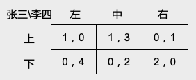
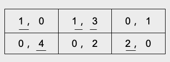

<!-- #REGION -->
<style>
:root {
  font-family: "Fira Sans", "Sans";
}

section {
  font-size: 32px;
}


h1, h2, h3 {
  text-align: center;
}

h1 {
  font-size: 1em;
  font-weight: normal;
  color: blue;
}

h2, h3 {
  font-size: 1em;
  font-weight: normal;
}

b, strong {
   color: blue;
   font-style: normal;
   font-weight: 500;
}

b, em {
   color: red;
   font-style: normal;
}

.columns {
    display: grid;
    grid-template-columns: repeat(2, minmax(0, 1fr));
    gap: 1rem;
}
</style>
<!-- #ENDREGION -->

# **Ch2: 最优反应, 优势策略**
## 授课教师: **雷浩然**
## 湖南大学课程

---

上一讲的核心概念: **严格劣势策略** 和 **重复剔除严格劣势策略**(**重复剔除法**).
- 严格劣势策略是一类"*坏策略*". 理性的参与人*永远不会选择严格劣势策略*.
- 我们可以反复剔除这些"坏策略", 直至博弈中不存在"坏策略"为止.
  - 这种方法叫作**重复剔除法**, 它可以用来预测博弈结果 (**"重复剔除均衡"**).
  - 对于部分博弈 (如囚徒困境, "中间选民定理"), 重复剔除法预测的博弈结果是唯一的. 也就是说, 这类博弈存在*唯一的*重复剔除均衡.
  - 对于部分博弈, 使用重复剔除法无法得到唯一的预测结果.
    比如, 对于不存在严格劣势策略的博弈 (如约会博弈, 石头剪刀布), 重复剔除法完全不适用.   


---

上一讲的核心概念: **严格劣势策略** 和 **重复剔除严格劣势策略**(**重复剔除法**).
- 严格劣势策略是一类"*坏策略*". 理性的参与人*永远不会选择严格劣势策略*.
- 我们可以反复剔除这些"坏策略", 直至博弈中不存在"坏策略"为止.
  - 这种方法叫作**重复剔除法**, 它可以用来预测博弈结果 (**"重复剔除均衡"**).
  - 对于部分博弈 (如囚徒困境, "中间选民定理"), 重复剔除法预测的博弈结果是唯一的. 也就是说, 这类博弈存在*唯一的*重复剔除均衡.
  - 对于部分博弈, 使用重复剔除法无法得到唯一的预测结果.
    比如, 对于不存在严格劣势策略的博弈 (如约会博弈, 石头剪刀布), 重复剔除法完全不适用.   


本讲的核心概念: 最优反应, 优势策略. (它们都是某种意义上的"*好策略*")

---
# 最优反应

考虑如下两人同时行动博弈:
- 参与人: $N = \{1, 2\}$
- 行动集: $A_1, A_2$
- 效用函数: $u_1(a_1, a_2)$, $u_2(a_1,a_2)$

---

# 最优反应

考虑如下同时行动博弈:
- 参与人: $N = \{1, 2\}$
- 行动集: $A_1, A_2$
- 效用函数: $u_1(a_1, a_2)$, $u_2(a_1,a_2)$

**定义:** 给定参与人2的行动 $a_2$,
若行动 $a_1^* \in A_1$ 最大化了参与人 $1$ 的效用,
则称 $a_1^*$ 是对 $a_{2}$ 的**最优反应**.

- 例: 给定李四的行动 $a_2 =$ 石头, 张三的最优反应: $a_1^* =$ 布

---

对于两人有限博弈 (即可以用一个收益矩阵来描述的博弈), 我们一般用**下划线**来标出参与人的**最优反应**.



---

# 下划线表示最优反应



---

# 最优反应: 约会博弈

张三 \ 李四 | 网吧 | 商场
---------|----------|---------
 网吧 | $(2,1)$ | $(0,0)$
 商场 | $(0,0)$ | $(1,2)$

---

# 最优反应: 约会博弈

张三 \ 李四 | 网吧 | 商场
---------|----------|---------
 网吧 | $(2,1)$ | $(0,0)$
 商场 | $(0,0)$ | $(1,2)$


张三 \ 李四 | 网吧 | 商场
---------|----------|---------
 网吧 | $(\underline{\red{2}}, \underline{\red{1}})$ | $(0,0)$
 商场 | $(0,0)$ | $(\underline{\red{1}}, \underline{\red{2}})$

---

# 最优反应: 数学描述 

给定行为人2的策略 $a_2 \in A_2$,
若行为人1的策略 ${a_1^*} \in A_1$ 满足下列不等式: 
$$
u_1 (a_1^*, a_2) \ge u_1 (a_1, a_2) \quad \forall a_1 \in A_1
$$
则称 ${a_1^*}$ 是对 $a_{2}$ 的**最优反应**.

- 换言之, ${a_1^*}$ 是对 $a_{2}$ 的最优反应, 当且仅当 ${a_1^*}$
是如下优化问题的解:
$$
\max_{a_1 \in A_1} u_1 (a_1, a_2)
$$

注: 这两个最优反应的定义和前面用文字描述的定义是等价的. 第一个定义是不等式描述,
第二个定义用到了 *最优化 (optimization)* 的数学语言.

---

**练习.** 说明并对比下面两个定义:
1. $a_1$ 是张三的**严格劣势策略**.
1. 针对李四的策略 $a_2$, 张三的**最优反应**是$a_1$.


---

**练习.** 说明并对比下面两个定义:
1. $a_1$ 是张三的**严格劣势策略**.
1. 针对李四的策略 $a_2$, 张三的**最优反应**是$a_1$.

第一个定义说的是, 存在某个张三的策略 $a_1'$, 使得*无论李四采取何种策略*,
$a_1$ 带给张三的效用都*严格小于* $a_1'$  带给张三的效用.

第二个定义说的是, *给定李四的策略 $a_2$*, 策略 $a_1$ 最大化了张三的效用.


---

# 判断正误
1. 如果 $a_1$ 是张三的劣势策略, 那么 $a_1$ 不可能是张三的最优反应.

---
# 判断正误: 答案
1. 如果 $a_1$ 是张三的劣势策略, 那么 $a_1$ 不可能是张三的最优反应. ❌


下例中, "上"是张三的劣势策略. 给定李四选 "左",
"上"是张三的最优反应.

```
张三\李四    左        右
上          (1,0)    (1,-1) 
下          (1,1)    (2,-2)
```

---

# 判断正误
2. 如果 $a_1$ 是张三的严格劣势策略, 那么 $a_1$ 不可能是张三的最优反应.

---
# 判断正误
2. 如果 $a_1$ 是张三的严格劣势策略, 那么 $a_1$ 不可能是张三的最优反应. ✅


**证明 (反证法).** 反设存在某个李四的策略 $a_2$, 使得
$a_1$ 是张三的最优反应. 也就是说, 
$$
u_1(a_1 , a_2) \ge u_1(\tilde a_1 , a_2) \quad \forall \tilde a_1 \in A_1. \quad\quad  \tag{1}
$$

由于 $a_1$ 是张三的严格劣势策略, 存在某个策略 $a_1'$ 使得
$$
u_1(a_1 , a_2) < u_1(a_1' , a_2) \quad\quad  \tag{2}
$$

(1)式和(2)式矛盾.

---

# 优势策略

最优反应是个"好策略", 但它针对的是某个具体的其他行为人的策略.

如果张三存在某个策略 $a_1^*$, 它对于**所有李四可能的行动**都是最优反应.
我们称满足这个条件的 $a_1^*$ 为张三的**优势策略** (dominant strategy).

---

# 优势策略

最优反应是个"好策略", 但它针对的是某个具体的其他行为人的策略.

如果张三存在某个策略 $a_1^*$, 它对于**所有李四可能的行动**都是最优反应.
我们称满足这个条件的 $a_1^*$ 为张三的**优势策略** (dominant strategy).

**定义:** 对于两人博弈, 若存在某个行为人1的策略 $a_1^*$, 使得下列不等式对*任意 $a_1 \in A_1$ 和 $a_2 \in A_2$* 都成立:
$$
u_1(a_1^*, a_2) \ge u_1(a_1^*, a_2)
$$
则称$a_1^*$ 为张三的**优势策略**.

---

# 理解优势策略

- 优势策略是"几乎完美"的策略:
  - 如果张三存在优势策略 $a_1^*$,
    那么张三不用去思考李四的策略或偏好, 也不用去思考李四有没有私人信息或者李四是不是理性的. 张三只用选 $a_1^*$ 就行, 因为无论李四最终的选择是什么, $a_1^*$ 都是张三的最优反应.

- 优势策略的例子:
  - 囚徒困境中选则坦白
  - 二价拍卖 (我们会在之后的不完备信息博弈中介绍)


---

# 优势策略均衡

- **优势策略均衡:** 每个参与人都选择他自己的优势策略.
  - 例: 囚徒困境, (坦白, 坦白)


```
张三 \ 李四     坦白             抵赖
坦白         (−5, −5)         (0, −8)
抵赖         (−8,  0)         (−1, −1)
```
(坦白, 坦白) 既是优势策略均衡, 也是重复剔除均衡.

---

# 优势策略均衡

- **优势策略均衡:** 每个参与人都选择他自己的优势策略.
  - 例: 囚徒困境, (坦白, 坦白)


```
张三 \ 李四     坦白             抵赖
坦白         (−5, −5)         (0, −8)
抵赖         (−8,  0)         (−1, −1)
```
(坦白, 坦白) 既是优势策略均衡, 也是重复剔除均衡.

**命题.** 如果一个策略组合 $(a_1, a_2)$  是*优势策略均衡*, 那么 $(a_1, a_2)$ 也一定是*重复剔除均衡*. 反之不真.
- 这个命题的证明较复杂. 同学们知道这个命题成立即可. 

---

# 从优势策略均衡到纳什均衡

- 优势策略均衡不是普遍存在的.
  - 比如约会博弈和选民博弈, 行为人都没有优势策略.

- 如果我们不要求策略组合 $(a_1, a_2)$ 中的每个策略都是优势策略,
  只要求 $a_1$ 和 $a_2$ 都是针对其他参与人策略的*最优反应*, 我们就得到了**纳什均衡**.

- 对于有限博弈 (参与人数量有限, 每个参与人的策略有限), 纳什均衡一定存在.
  (**纳什定理**)

---

## 优势策略均衡 $\subset$ 重复剔除均衡 $\subset$ 纳什均衡

## 

---

# 纳什均衡: Nash (1950) 和 Nash (1951)

John Nash (1950): "Equilibrium points in $n$-person games"

- 在这篇论文中, Nash 提出均衡的概念, 并用 **Kakutani 不动点定理**证明了均衡的存在性.
- 课程网站提供了论文的 PDF. *全文仅一页*
- 后人将这种均衡称为**纳什均衡**, 均衡的存在性定理称为**纳什定理**.

在随后的一篇更正式的论文中, Nash 给出了一个均衡存在性的简化证明 (主要工具是
**Brouwer 不动点定理**), 以及纳什均衡在扑克牌游戏中的应用.

- John Nash (1951): "Non-cooperative games". 全文十页
