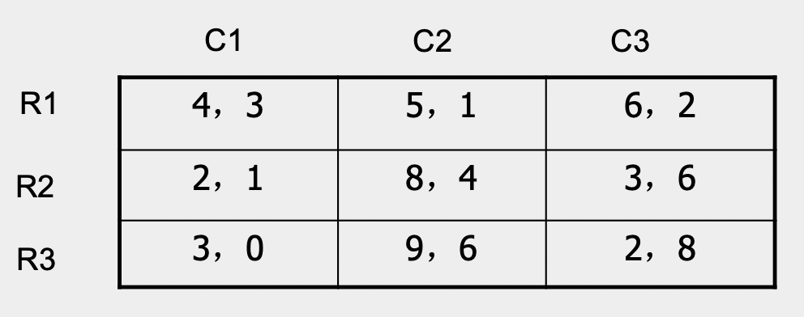
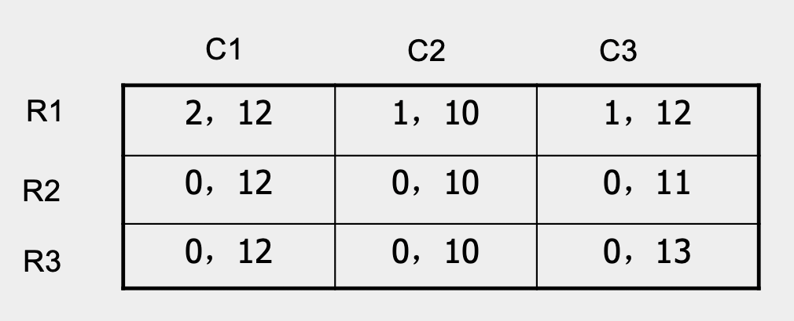

<!-- #REGION -->
<style>
:root {
  font-family: "Fira Sans", "Sans";
}

h1, h2, h3 {
  text-align: center;
}

h1 {
  font-size: 1em;
  font-weight: normal;
  color: blue;
}

h2, h3 {
  font-size: 1em;
  font-weight: normal;
}

b, strong {
   color: blue;
   font-style: normal;
   font-weight: 500;
}

b, em {
   color: red;
   font-style: normal;
}

.columns {
    display: grid;
    grid-template-columns: repeat(2, minmax(0, 1fr));
    gap: 1rem;
}
</style>    
<!-- #ENDREGION -->

<!--  _class: lead -->

# **第二章：完备信息静态博弈**
## 授课教师: **雷浩然**
## 湖南大学课程

---

# 完备信息静态博弈

静态博弈 $=$ 同时行动博弈。三个基本元素:
- 参与人
- 行动集合
- 效用函数

---

# 完备信息静态博弈

静态博弈 $=$ 同时行动博弈。三个基本元素:
- 参与人
- 行动集
- 效用函数

之后我们在介绍动态博弈和不完备信息时，会引入两个新元素：**策略**和**信息集**。
- 对于完备信息静态博弈，暂时不用引入这两个元素.

---

# 参与人

- **参与人**指的是博弈中的决策主体，它的目的是通过选择行动（或策略）以最大化自己的效用水平

- 经济博弈中的参与人：
  - 消费者，投资者，企业、国家或由若干国家组成的集团

- 数学符号：
  - 参与人构成集合 $N = \{1,..., n\}$
  - 参与人1，参与人2,…, 参与人 𝑛

- 例子：$\{张三， 李四\}$

---

# 行动集

- 对于参与人 $i$, 用集合 $A_i$ 表示其**行动集**
- 参与人 $i$ 的某个**行动**记为 $a_i \in A_i$
- 例：
  $$
  A_1 = A_2 = \{ 石头,剪刀, 布  \}
  $$
- 石头剪刀布博弈的 **结果** 表示为向量 $(a_1, a_2) \in A_1 \times A_2$ 


---

# 效用函数
- 参与人 $i$ 的效用函数 $u_i$: 博弈结果到实数的映射
  $$
  u_i: A_1 \times \dots A_n \to \mathbb R
  $$
- 例: 剪刀石头布博弈, 获胜时收益为 $1$, 失败收益为 $-1$, 平局为 $0$ 

---

# 效用函数
- 参与人 $i$ 的效用函数 $u_i$: 博弈结果到实数的映射
  $$
  u_i: A_1 \times \dots A_n \to \mathbb R
  $$
- 例: 剪刀石头布博弈, 获胜时收益为 $1$, 失败收益为 $-1$, 平局为 $0$ 

博弈的基本特征: 参与人 $1$ 的最终收益不仅取决于他自己的决策 
$a_1$, 还取决于其他参与人的决策: $a_2, a_3,...$

- 我们称这个现象为**策略性互动** (strategic interaction), 或参与人的收益存在"互相依赖"
- 这个概念很类似**外部性**

---

<!-- _class: lead -->
# 例: 囚徒困境

---

# 囚徒困境

- 囚徒困境是一个非常经典的 **完备信息同时行动博弈**
- 两位犯罪嫌疑人 (张三和李四) 被警方分离开, 单独审问
- 面对警方询问, 犯罪嫌疑人会选择**合作** (抵赖)或**背叛** (坦白)
  - 若两人都选择合作, 则两人均 "拘留7天"
  - 若张三选择合作, 而李四背叛. 则张三判刑 5 年,李四无罪释放
  - 若两人都选择背叛, 则两人均判刑 1 年

---

# 囚徒困境: 博弈描述

- 行为人: $N = \{1,2\}$. 张三是行为人 $1$,李四是行为人 $2$
- 行动集: $A_1 = A_2 =$ {坦白, 抵赖}

---

# 囚徒困境: 博弈描述

- 行为人: $N = \{1,2\}$. 张三是行为人 $1$,李四是行为人 $2$
- 行动集: $A_1 = A_2 =$ {坦白, 抵赖}
- 效用函数表示为如下"收益矩阵":

```
张三 \ 李四      坦白             抵赖
坦白         (1 年, 1 年)    (无罪, 5 年)
抵赖         (5 年, 无罪)     (7 天, 7天)
```

---

# 囚徒困境: 博弈描述

- 行为人: $N = \{1,2\}$. 张三是行为人 $1$,李四是行为人 $2$
- 行动集: $A_1 = A_2 =$ {坦白, 抵赖}
- 效用函数表示为如下收益矩阵:

```
张三 \ 李四     坦白             抵赖
坦白         (−5, −5)         (0, −8)
抵赖         (−8,  0)         (−1, −1)
```

- 如果你是张三, 你的选择是 ?

---

# 严格劣势策略
- 若李四选则**坦白**, 张三选择坦白和抵赖的收益分别为: $-5$, $-8$
- 若李四选则*抵赖*, 张三选择坦白和抵赖的收益分别为: $0$, $-1$

---

# 严格劣势策略
- 若李四选则**坦白**, 张三选择坦白和抵赖的收益分别为: $-5$, $-8$
- 若李四选则*抵赖*, 张三选择坦白和抵赖的收益分别为: $0$, $-1$

结论: 张三应该选**坦白**, 不应该选*抵赖*.

-  因为无论李四的选择是什么, **坦白**的收益都大于*抵赖*的收益.
-  *抵赖* 是张三的严格劣势策略
   - 注: 对于完备信息同时行动博弈, "策略"是"行动"的同义词
   - 我们一般不说劣势行动, 只说**劣势策略** 

---

练习: 寻找严格劣势策略 (如果有的话)

1 \ 2 | 左 | 右
---------|----------|---------
 上 | (1 , 0) | (-1, -3)
 下 | (-3, -1) |( 0, 1)

1 \ 2 | 左 | 右
---------|----------|---------
 上 | (1, 0) | (1, -3)
 下 | (-3 , -1) | (0, 1)
   
---

# 练习答案

- 第一个博弈中, 双方参与人均不存在严格劣势策略

- 第二个博弈中, 参与人 $1$ 存在严格劣势策略, 参与人 $2$ 不存在.


这个练习的背景是另一个非常经典的博弈: 协调博弈 (coordination game). 有时也把它叫作约会博弈.


---

# 严格劣势策略: 定义
对于两人博弈, 若参与人 1 存在两个策略
$a_优$ 和 $a_劣$ 使得
$$
u_1(a_优, a_2) > u_1(a_劣, a_2) \quad \forall a_2 \in A_2
$$
我们称策略 $a_优$ **严格优于** $a_劣$,
并称 $a_劣$ 是参与人 1 的**严格劣势策略**.

---

# 严格劣势策略: 文字定义
 
1. 对于参与人 $i$, 若*无论其他参与人选择何种策略*,
策略 $a_优$ 带给参与人 $i$ 的效用都严格大于策略 
$a_劣$ 带来的效用, 则称$a_优$ **严格优于** $a_劣$. 

1. 对于参与人 $i$, 策略 $a_i$ 是参与人 $i$ 的**严格劣势策略**当且仅当*存在另外一个策略* $a_i'$ 使得
$a_i'$ 严格优于 $a_i$.

---

练习: 对于两人博弈, 若策略 $a_2$ 是参与人2的严格劣势策略,
请描述对应的不等式关系.

---

练习: 对于两人博弈, 若策略 $a_2$ 是参与人2的严格劣势策略,
请描述对应的不等式关系.


存在某个参与人2的策略 $a_2'$, 使得下列的不等式对所有参与人1的策略$a_1$ 都成立:
$$
u_2(a_1, a_2' ) >  u_2(a_1, a_2) \quad \forall a_1 \in A_1 
$$

---

# 劣势策略: 定义 (暂时了解即可)
对于两人博弈, 若参与人 1 存在两个策略 $a_优$ 和 $a_劣$, 使得
1. $u_1(a_优, a_2) \ge u_1(a_劣, a_2) \quad \forall a_2 \in A_2$
2. 存在某个参与人2的策略 $a_2'$ 使得不等式严格成立:   
   $u_1(a_优, a_2') > u_1(a_劣, a_2')$ 

我们称策略 $a_优$ **优于** $a_劣$,
并称 $a_劣$ 是参与人 1 的**劣势策略**.

如果某个劣势策略 $a_劣$ 不是**严格劣势策略**, 称它为**不严格劣势策略**

---

# 劣势策略: 文字定义
定义1: 对于参与人 $i$, 若
1. *无论其他参与人选择何种策略*,
策略 $a_优$ 带给参与人 $i$ 的效用都大于或等于策略 
$a_劣$ 带来的效用; 
1. 存在某个其他参与人的策略组合, 使得策略
$a_优$ 带给参与人 $i$ 的效用严格大于
$a_劣$ 带来的效用, 

则称$a_优$ **优于** $a_劣$. 

定义2: 对于参与人 $i$, 策略 $a_i$ 是参与人 $i$ 的**劣势策略**当且仅当*存在另外一个策略* $a_i'$ 使得
$a_i'$ 优于 $a_i$.

---

# 剔除严格劣势策略

- 博弈论的研究目标之一, 是给出模型中参与人行为的**预测**.

- 一个基本预测: 理性参与人不会选择严格劣势策略.
  - 因此, 我们可以将所有的严格劣势策略从分析中剔除!
  - 对于囚徒博弈, 双方行为人都不选 *抵赖*. 因此,
    最终的博弈结果一定是双方都选择坦白.

---

练习: 剔除严格劣势策略

1 \ 2 | 左 | 右
---------|----------|---------
 上 | (1, 0) | (1, -3)
 下 | (-3 , -1) | (0, 1)
   
---

练习: 剔除严格劣势策略

1 \ 2 | 左 | 右
---------|----------|---------
 上 | (1, 0) | (1, -3)
 下 | (-3 , -1) | (0, 1)

- 在原始博弈中, 参与人 2 不存在严格劣势策略.
- 剔除了参与人 1 的严格劣势策略 ("下") 之后呢?
  - **重复剔除严格劣策略**
  - 给定参与人 1 选 "上", 参与人 2 会选 "左".

---

以下仍然以两人博弈为例说明**重复剔除严格劣策略**:

0. 张三和李四的可选策略分别记为:
   $\{a_{11}, ..., a_{1m}\}$,
   $\{a_{21}, ..., a_{2n}\}$

1. 剔除张三和李四的严格劣策略, 记两人剩下的可选策略为:
   $\{a_{11}', ..., a_{1m'}'\}$,
   $\{a_{21}', ..., a_{2n'}'\}$.

   经过一轮剔除后, 李四剩余的策略变少. 这时, 给定李四的所有可能策略, 我们可以继续剔除张三剩余策略中的严格劣策略 (如有). 

1. 剔除张三和李四的严格劣策略.
1. ...
1. 重复以上过程, 直至无法剔除更多的策略.

---

# 重复剔除严格劣策略: 练习




---
# 练习1答案

先剔除C2，再剔除R2,R3，最后剔除C3

---

# 重复剔除严格劣策略: 练习2



---

# 练习2答案

剩余策略: R1, C1和C3.

---

# 练习2答案

剩余策略: R1, C1和C3.


使用重复剔除严格劣策略, 无法给出博弈结果的唯一预测.
- 我们只知道张三会使用 R1
- 我们无法判断李四会用 C1 还是 C3.
- 存在两种可能的博弈结果: (R1,C1), (R1,C3)

**问:** 你觉得在真实博弈中, (R1,C1) 和 (R1,C3) 哪种结果更可能出现?

---

# 关于重复剔除严格劣策略的补充说明 (简单了解即可)

- 考虑张三和李四的两人博弈. 为了预测博弈结果, 
我们首先剔除张三和李四的严格劣策略. 这个步骤成立的前提是什么?


---

# 关于重复剔除严格劣策略的补充说明 (简单了解即可)

- 考虑张三和李四的两人博弈. 为了预测博弈结果, 
我们首先剔除张三和李四的严格劣策略. 这个步骤成立的前提是什么?   
  **张三是理性的**; **李四是理性的**; 两人都懂得 contingent thinking.

---

# 关于重复剔除严格劣策略的补充说明 (简单了解即可)

- 考虑张三和李四的两人博弈. 为了预测博弈结果, 
我们首先剔除张三和李四的严格劣策略. 这个步骤成立的前提是什么?   
  **张三是理性的**; **李四是理性的**; 两人都懂得 contingent thinking.

- 经过第一轮剔除后, 为了更好地预测博弈结果, 我们又剔除了这个简化博弈中的严格劣策略. 第二轮剔除的成立依赖什么潜在假设?    

---

# 关于重复剔除严格劣策略的补充说明 (简单了解即可)

- 考虑张三和李四的两人博弈. 为了预测博弈结果, 
我们首先剔除张三和李四的严格劣策略. 这个步骤成立的前提是什么?   
  **张三是理性的**; **李四是理性的**; 两人都懂得 contingent thinking.

- 经过第一轮剔除后, 为了更好地预测博弈结果, 我们又剔除了这个简化博弈中的严格劣策略. 第二轮剔除的成立依赖什么潜在假设?   
  **张三知道李四是理性的, 李四知道张三是理性的.**
  
---

# 关于重复剔除严格劣策略的补充说明 (简单了解即可)
类似可得:

- 第三轮剔除的前提假设:    
  **张三知道***李四知道***张三是理性**的, **李四知道***张三知道***李四是理性**的

- 第四轮剔除的前提假设:   
  **张三知道***李四知道***张三知道***李四是理性*的, ...

- ... 依此类推第五轮, 第六轮剔除的前提假设.

对于复杂博弈,
为了使用重复剔除严格劣策略的方法, 通常会假设"行为人是理性的"是所有参与人的**共同知识** (common knowledge).

---

# 小结

以下内容是你需要*掌握*的:
- 策略 $a_i$ **严格优于**策略 $a_i'$ 的数学定义 + 文字定义
- 策略 $a_i$ 是**严格劣势策略**的数学定义 + 文字定义
- 策略 $a_i$ **优于**策略 $a_i'$ 的文字定义
- 使用**重复剔除严格劣策略**来预测博弈结果

---

<!-- _class: lead  -->

# 重复剔除严格劣策略的应用:
# **商场选址**, **中间选民定理**

---

# One model, Two situations

- 描述1: 张三和李四是两位**政客**, 他们考虑在竞选时应采取何种**政治立场**, 从而**吸引更多的选票**.

- 描述2: 张三和李四是两位**饭店老板**,
他们考虑应选择何处作为**店铺地址**, 从而**吸引更多的顾客**.

以上两个情景可以抽象为同一个博弈模型.

---

# 博弈描述

- **参与人**: 张三和李四
- **行动集**: $A_1 = A_2 = \{1,2,3,4,5\}$. 每个行动对应一个具体"位置":
  ```
  __1__   __2__   __3__   __4__   __5__
  ```  
- **效用函数**:
  - 消费者(或选民)均匀地分布在所有可能位置上
  - 消费者(或选民)会选择距离他最近的参与人; 若参与人选择同一位置, 则均分所有消费者(或选民)   
  - 参与人的目标: 最大化他能吸引到的消费者(或选民)

---

# 收益矩阵


```
张三\李四  1          2          3          4          5
1        (2.5, 2.5) (1  , 4  ) (1.5, 3.5) (2  , 3  ) (2.5, 2.5)
2        (4  , 1  ) (2.5, 2.5) (2  , 3  ) (2.5, 2.5) (3  , 2  )
3        (3.5, 1.5) (3  , 2  ) (2.5, 2.5) (3  , 2  ) (3.5, 1.5)
4        (3  , 2  ) (2.5, 2.5) (2  , 3  ) (2.5, 2.5) (4  , 1  )
5        (2.5, 2.5) (2  , 3  ) (1.5, 3.5) (1  , 4  ) (2.5, 2.5)
```

---

# 重复剔除严格劣策略
0. 所有可能的行动

  ```
  __1__   __2__   __3__   __4__   __5__
  ```  
1. 第一轮剔除


  ```
          __2__   __3__   __4__
  ```  

2. 第二轮剔除


  ```
                  __3__
  ```  

---

重复剔除严格劣策略的预测结果:
- 张三和李四都会选择中点位置.
- 这个结果的成立不依赖于我们的两个简化假设:   
  (1) 只有5个位置 (任意$N \ge 3$个位置) (2) 选民的分布是均匀的

政治经济学: **中间选民定理**
- 中间选民决定了当选政客的政治主张

企业选址: **小餐馆为何总是扎堆开在一起?**

---

# 推荐阅读

- 耶鲁大学公开课: [重复剔除与中间选民定理](https://oyc.yale.edu/economics/econ-159/lecture-3)
- https://knowledgehive.github.io/Game-Theory/lecture%203.html
